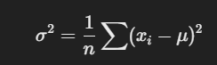
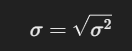

Here’s a list of essential **statistical functions** in NumPy, along with their **mathematical explanations** and **use cases**:

---

## 1️⃣ **Mean (Average)**


-   **Function**: `np.mean()`
-   **Formula**:  
-  
**Use Case**: Measures the **central tendency** of data.
-   **Example**:
    ```python
    import numpy as np
    data = np.array([10, 20, 30, 40])
    print(np.mean(data))  # Output: 25.0
    ```

---

## 2️⃣ **Median**

-   **Function**: `np.median()`
-   **Definition**: The **middle value** in a sorted dataset.
-   **Use Case**: Useful when **data is skewed** (e.g., salaries).
-   **Example**:
    ```python
    data = np.array([1, 2, 5, 10, 100])
    print(np.median(data))  # Output: 5
    ```

---

## 3️⃣ **Mode (Most Frequent Value)**

-   **Function**: `scipy.stats.mode()`
-   **Use Case**: Useful in **categorical data** (e.g., most common rating).
-   **Example**:
    ```python
    from scipy import stats
    data = np.array([1, 2, 2, 3, 3, 3, 4])
    print(stats.mode(data).mode[0])  # Output: 3
    ```

---

## 4️⃣ **Variance (σ²)**

-   **Function**: `np.var()`
-   **Formula**:  
    
-   **Use Case**: Measures **spread of data**.
-   **Example**:
    ```python
    data = np.array([10, 20, 30, 40])
    print(np.var(data))  # Output: 125.0
    ```

---

## 5️⃣ **Standard Deviation (σ)**

-   **Function**: `np.std()`
-   **Formula**:  
    
-   **Use Case**: Measures **dispersion**, used in risk analysis.
-   **Example**:
    ```python
    data = np.array([10, 20, 30, 40])
    print(np.std(data))  # Output: 11.18
    ```

---

## 6️⃣ **Percentile**

-   **Function**: `np.percentile()`
-   **Definition**: The value **below which a given % of observations fall**.
-   **Use Case**: Used in **exam scores, wealth distribution**.
-   **Example**:
    ```python
    data = np.array([10, 20, 30, 40, 50])
    print(np.percentile(data, 50))  # Output: 30 (median)
    ```

---

## 7️⃣ **Quantiles**

-   **Function**: `np.quantile()`
-   **Definition**: Similar to percentile but in fraction format.
-   **Example**:
    ```python
    print(np.quantile(data, 0.25))  # 25th percentile
    ```

---

## 8️⃣ **Minimum & Maximum**

-   **Function**: `np.min()`, `np.max()`
-   **Use Case**: Find **extreme values**.
-   **Example**:
    ```python
    print(np.min(data))  # Output: 10
    print(np.max(data))  # Output: 50
    ```

---

## 9️⃣ **Range**

-   **Formula**:  
    \[
    \text{Range} = \max(x) - \min(x)
    \]
-   **Example**:
    ```python
    print(np.max(data) - np.min(data))  # Output: 40
    ```

---

## 🔟 **Interquartile Range (IQR)**

-   **Formula**:  
    \[
    IQR = Q3 - Q1
    \]
-   **Use Case**: Measures **spread without outliers**.
-   **Example**:
    ```python
    Q1 = np.percentile(data, 25)
    Q3 = np.percentile(data, 75)
    print(Q3 - Q1)  # Output: IQR
    ```

---

## 🔢 **Skewness**

-   **Function**: `scipy.stats.skew()`
-   **Definition**: Measures **asymmetry**.
-   **Example**:
    ```python
    print(stats.skew(data))
    ```

---

## 🔢 **Kurtosis**

-   **Function**: `scipy.stats.kurtosis()`
-   **Definition**: Measures whether data has **heavy/light tails**.
-   **Example**:
    ```python
    print(stats.kurtosis(data))
    ```

---

## Summary Table 📊

| Function                 | Description                 | Use Case                         |
| ------------------------ | --------------------------- | -------------------------------- |
| `np.mean()`              | Average of data             | Finding the central value        |
| `np.median()`            | Middle value of sorted data | Skewed distributions             |
| `scipy.stats.mode()`     | Most frequent value         | Categorical data                 |
| `np.var()`               | Spread of data (σ²)         | Risk assessment                  |
| `np.std()`               | Square root of variance (σ) | Stock market, quality control    |
| `np.percentile()`        | Percentile (e.g., 50%)      | Exam scores, wealth distribution |
| `np.min()` / `np.max()`  | Minimum and maximum         | Extreme values detection         |
| `np.quantile()`          | Similar to percentile       | Quartile-based analysis          |
| `np.ptp()`               | Range (max-min)             | Data spread measurement          |
| `np.percentile()`        | Interquartile Range (IQR)   | Outlier detection                |
| `scipy.stats.skew()`     | Skewness                    | Distribution asymmetry           |
| `scipy.stats.kurtosis()` | Kurtosis                    | Detecting fat-tailed data        |

---

### **Final Notes**

-   If your dataset is large and you want **fast computation**, use NumPy.
-   If you need **advanced statistics** (e.g., hypothesis testing, regression), use `scipy.stats`.
-   **Always visualize** distributions with `matplotlib` or `seaborn` for better insights.

---
