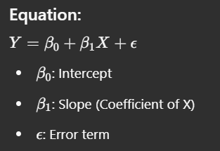

# Model Development and Evaluation

## 1. Simple Linear Regression (SLR)

### Definition:

Simple Linear Regression is a statistical method used to model the relationship between a dependent variable (Y) and a single independent variable (X) using a linear equation.

### Equation:

### Implementation in Python:

```python
from sklearn.linear_model import LinearRegression

model = LinearRegression()
model.fit(X_train, y_train)
y_pred = model.predict(X_test)
```

## 2. Multiple Linear Regression (MLR)

### Definition:

Multiple Linear Regression extends SLR by incorporating multiple independent variables.

### Equation:

\[ Y = \beta_0 + \beta_1X_1 + \beta_2X_2 + ... + \beta_nX_n + \epsilon \]

### Implementation in Python:

```python
X = df[['feature1', 'feature2', 'feature3']]
y = df['target']
model = LinearRegression()
model.fit(X, y)
y_pred = model.predict(X)
```

## 3. Polynomial Regression

### Definition:

Polynomial Regression is a type of regression where the relationship between the independent variable and dependent variable is modeled as an nth-degree polynomial.

### Equation:

\[ Y = \beta_0 + \beta_1X + \beta_2X^2 + ... + \beta_nX^n + \epsilon \]

### Implementation in Python:

```python
from sklearn.preprocessing import PolynomialFeatures

poly = PolynomialFeatures(degree=2)
X_poly = poly.fit_transform(X)
model = LinearRegression()
model.fit(X_poly, y)
y_pred = model.predict(X_poly)
```

## 4. Pipeline

### Definition:

Pipelines automate the workflow by chaining preprocessing and modeling steps together.

### Implementation in Python:

```python
from sklearn.pipeline import Pipeline
from sklearn.preprocessing import StandardScaler

pipeline = Pipeline([
    ('scaler', StandardScaler()),
    ('model', LinearRegression())
])
pipeline.fit(X_train, y_train)
y_pred = pipeline.predict(X_test)
```

## 5. Cross-Validation

### Definition:

Cross-validation is a technique used to evaluate a model by splitting the dataset into multiple subsets.

### Example: k-Fold Cross-Validation (k=5)

```python
from sklearn.model_selection import cross_val_score

scores = cross_val_score(model, X, y, cv=5)
print("Mean accuracy:", scores.mean())
```

## 6. Grid Search

### Definition:

Grid Search is used to find the optimal hyperparameters by evaluating multiple parameter combinations.

### Implementation in Python:

```python
from sklearn.model_selection import GridSearchCV

params = {'alpha': [0.01, 0.1, 1, 10]}
model = Ridge()
grid = GridSearchCV(model, params, cv=5)
grid.fit(X_train, y_train)
print("Best Alpha:", grid.best_params_['alpha'])
```

## 7. Ridge Regression

### Definition:

Ridge Regression is a regularized version of Linear Regression that reduces overfitting by adding an L2 penalty to the loss function.

### Equation:

\[ \sum (Y - \hat{Y})^2 + \lambda \sum \beta_i^2 \]

### Implementation in Python:

```python
from sklearn.linear_model import Ridge

ridge = Ridge(alpha=1.0)
ridge.fit(X_train, y_train)
y_pred = ridge.predict(X_test)
```

## 8. Model Evaluation Metrics

### Common Metrics:

-   **Mean Squared Error (MSE)**: Measures average squared difference between actual and predicted values.
-   **Root Mean Squared Error (RMSE)**: Square root of MSE, interpretable in the same units as Y.
-   **R-squared (R²)**: Measures how well the model explains variance in Y.

### Implementation in Python:

```python
from sklearn.metrics import mean_squared_error, r2_score

mse = mean_squared_error(y_test, y_pred)
rmse = mse ** 0.5
r2 = r2_score(y_test, y_pred)
```

## Conclusion

Understanding these fundamental concepts in model development and evaluation helps in building robust predictive models while preventing overfitting and underfitting. Applying cross-validation, regularization, and hyperparameter tuning ensures better generalization of the model.
