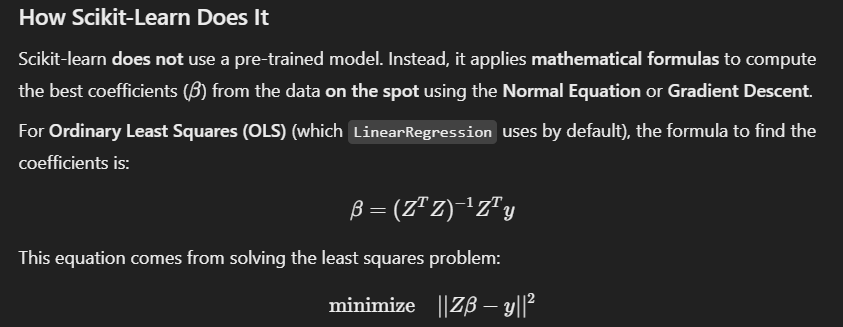

 **how** scikit-learn's `LinearRegression` works under the hood—like how it takes in data and finds the best-fitting equation.  

### How Scikit-Learn Does It  





Scikit-learn **does not** use a pre-trained model. Instead, it applies **mathematical formulas** to compute the best coefficients (\(\beta\)) from the data **on the spot** using the **Normal Equation** or **Gradient Descent**.  

For **Ordinary Least Squares (OLS)** (which `LinearRegression` uses by default), the formula to find the coefficients is:  
\[
\beta = (Z^T Z)^{-1} Z^T y
\]

This equation comes from solving the least squares problem:  

\[
\text{minimize} \quad ||Z\beta - y||^2
\]

where:  
- \(Z\) is your feature matrix (independent variables).  
- \(y\) is the target (dependent variable).  
- \(\beta\) is what we want to find.  

### Simple Python Code to Mimic Scikit-Learn  

Here’s a **manual implementation** of linear regression **without scikit-learn**, just using NumPy:  

```python
import numpy as np

# Sample data: 4 features (Z) and target (y)
Z = np.array([[1, 2, 3, 4], 
              [5, 6, 7, 8], 
              [9, 10, 11, 12], 
              [13, 14, 15, 16]])

y = np.array([100, 200, 300, 400])

# Add a column of ones for the intercept
Z = np.hstack([np.ones((Z.shape[0], 1)), Z])  # Now Z has a bias term

# Compute the coefficients using the Normal Equation
beta = np.linalg.inv(Z.T @ Z) @ Z.T @ y

# Extracting intercept and coefficients
intercept = beta[0]
coefficients = beta[1:]

print("Intercept:", intercept)
print("Coefficients:", coefficients)
```

### What This Does:
1. Adds a column of ones to `Z` for the **intercept**.
2. Uses the **Normal Equation** to compute \(\beta\).
3. Splits the **intercept** and **coefficients**.
4. Outputs the final **model equation**.

This is a **simplified version** of what scikit-learn does behind the scenes. 🚀