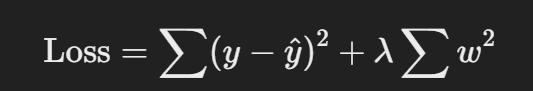

### **Ridge Regression (L2 Regularization) – Simple Explanation**

#### **Why Do We Need Ridge Regression?**

-   When doing **Linear Regression**, sometimes the model **overfits** (performs well on training data but badly on new data).
-   This happens when **some features have very large coefficients**, making the model sensitive to small changes.

#### **What Does Ridge Do?**

-   **Adds a penalty to large coefficients** to keep them small.
-   This **prevents overfitting** and makes the model more **generalizable**.

#### **Mathematical Formula:**

Ridge modifies the **Linear Regression loss function** by adding a penalty:



-   **First term** → Normal Mean Squared Error (MSE).
-   **Second term** → Adds the **sum of squared weights** (L2 penalty).
-   **λ (lambda)** → Controls the strength of the penalty:
    -   **λ = 0** → Normal Linear Regression.
    -   **Small λ** → Slight regularization (reduces overfitting).
    -   **Large λ** → Strong regularization (shrinks coefficients too much, underfitting possible).

#### **Key Benefits of Ridge Regression:**

-   **Reduces overfitting** without removing features.
-   Works well when you have **many correlated features**.
-   Keeps all features in the model, but **shrinks their impact**.

#### **When to Use Ridge?**

-   When your dataset has **many features** that might cause overfitting.
-   When features are **highly correlated** (multicollinearity).

#### **Code Example (Using Sklearn):**

```python
from sklearn.linear_model import Ridge
from sklearn.model_selection import train_test_split

# Sample Data
X = df[['horsepower', 'curb-weight', 'engine-size', 'highway-mpg']]
y = df['price']

# Split Data
X_train, X_test, y_train, y_test = train_test_split(X, y, test_size=0.2, random_state=42)

# Train Ridge Regression
ridge = Ridge(alpha=1.0)  # λ = 1.0
ridge.fit(X_train, y_train)

# Predictions
y_pred = ridge.predict(X_test)
```

**TL;DR:** Ridge Regression **prevents overfitting** by penalizing large coefficients, making the model **more stable** and **generalizable**. 🚀

Setting **alpha = 1.0** is just an example, but in real cases, you should **tune it** to find the best value.

### **How to Choose the Best Alpha (λ)?**

-   **α (lambda) controls regularization strength**:
    -   **Small α (close to 0)** → Less regularization (behaves like normal Linear Regression).
    -   **Large α** → More regularization (shrinks coefficients a lot, can cause underfitting).

### **Finding the Best Alpha – Use Cross-Validation**

Instead of manually setting **alpha = 1**, we use **cross-validation** to test multiple values and pick the best one.

#### **Example: Using RidgeCV to Automatically Find Best Alpha**

```python
from sklearn.linear_model import RidgeCV

# Define a range of alpha values to test
alphas = [0.01, 0.1, 1, 10, 100]

# RidgeCV will find the best alpha from the list
ridge_cv = RidgeCV(alphas=alphas, store_cv_values=True)
ridge_cv.fit(X_train, y_train)

# Best alpha value
best_alpha = ridge_cv.alpha_
print(f"Best alpha value: {best_alpha}")
```

👉 This will **test multiple alpha values** and pick the best one based on **cross-validation performance**.

### **Conclusion:**

-   **Alpha is NOT fixed**; it should be **tuned** for the dataset.
-   **Use RidgeCV** to **automatically** find the best alpha.
-   If **alpha is too high** → Model might underfit.
-   If **alpha is too low** → Model might still overfit.

**So yeah, setting α = 1 for all iterations would be useless! 🔥 Always tune it!** 🚀
